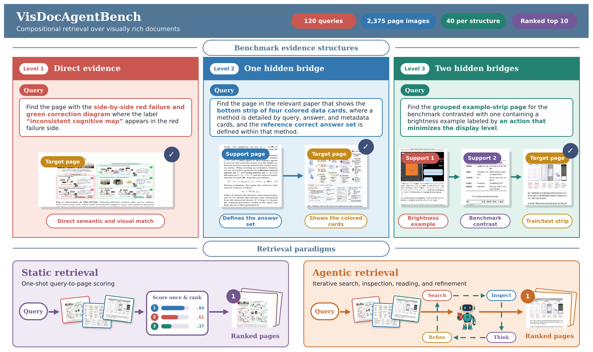
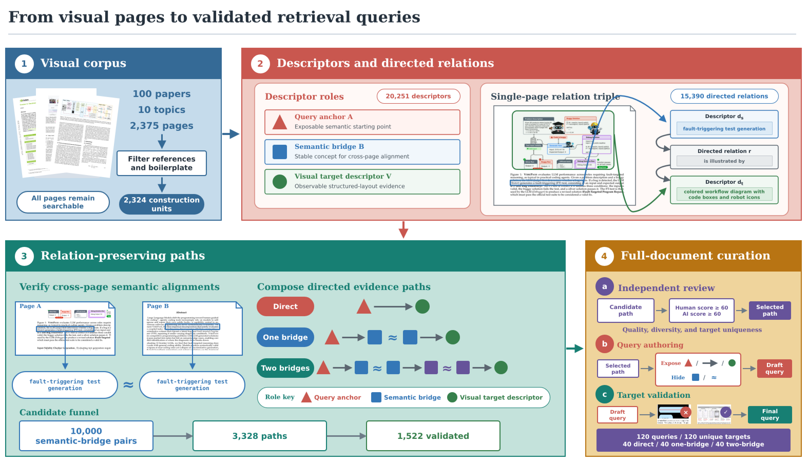

<div align="center">

# VisDocAgentBench

### Benchmarking Agents for Visually Rich Document Retrieval

[](https://arxiv.org/pdf/2608.17889)
[](https://hulx2002.github.io/VisDocAgentBench)
[](https://huggingface.co/datasets/hulx2002/VisDocAgentBench)
[](LICENSE)

</div>

<p align="center">
  
</p>

VisDocAgentBench evaluates **closed-corpus retrieval over visually rich documents**. It asks retrieval systems to rank pages whose relevance may depend on text, layout, structured visual evidence, and context found elsewhere in the corpus. Static retrievers and tool-using agents share the same corpus, queries, and ranked top-10 output contract.

<table>
  <tr>
    <td align="center"><strong>2,375</strong><br>rendered pages</td>
    <td align="center"><strong>100</strong><br>documents</td>
    <td align="center"><strong>120</strong><br>unique-target queries</td>
    <td align="center"><strong>40 / 40 / 40</strong><br>direct / one-bridge / two-bridge</td>
    <td align="center"><strong>R@1/3/5/10</strong><br>and MRR@10</td>
  </tr>
</table>

## Benchmark

Each query has one answer page and follows a direct, one-bridge, or two-bridge evidence structure. The benchmark construction preserves directed semantic relations across pages, then applies independent full-document review and hard-negative validation.

<p align="center">
  
</p>

## Repository Scope

This repository contains the evaluation code, deterministic corpus reconstruction and preprocessing utilities, static retrieval baselines, the fixed two-stage VLM reranker, and the released visual and OCR-text agent harnesses. Generated predictions, agent traces, OCR caches, embeddings, and model weights are intentionally not distributed; they can be regenerated with the commands below.

## Quick Start

### 1. Installation

Create separate environments for the agent/OCR tools and vLLM services. The versions used in our experiments are recorded in the requirement files.

```bash
git clone https://github.com/hulx2002/VisDocAgentBench.git
cd VisDocAgentBench

python -m venv .venv
source .venv/bin/activate
pip install -r requirements-ocr.txt
# Install the PaddlePaddle GPU wheel matching your CUDA installation.
```

For the Qwen embedding services, or when using vLLM to host an open-weight planner:

```bash
python -m venv .venv-vllm
source .venv-vllm/bin/activate
pip install -r requirements-vllm.txt
```

### 2. Download and Validate the Data

```bash
python scripts/download_data.py
python dataset_tools/validate_dataset.py
```

The dataset repository directly includes 1,469 page images whose source licenses permit redistribution. The manifest still describes all 2,375 pages. Reconstruct the remaining pages from their exact arXiv versions with:

```bash
python dataset_tools/download_and_render.py
python dataset_tools/validate_dataset.py --require-complete-corpus
```

The reconstruction script renders every missing PDF page at 144 DPI, matching the benchmark corpus. See [docs/data.md](docs/data.md) for the file schema and licensing boundary.

### 3. Prepare Models and Derived Inputs

Download the released open models:

```bash
python scripts/download_models.py
```

The 752 GB Qwen3.5 planner checkpoint is excluded from the default download. Fetch it separately when reproducing the open-weight planner runs:

```bash
python scripts/download_models.py --models qwen35-planner
```

Start the two embedding services in separate terminals or on separate GPUs:

```bash
CUDA_VISIBLE_DEVICES=0 bash scripts/start_visual_embedding_service.sh
CUDA_VISIBLE_DEVICES=1 bash scripts/start_text_embedding_service.sh
```

Build the OCR cache and baseline inputs:

```bash
python dataset_tools/build_ocr_cache.py
bash scripts/prepare_baseline_inputs.sh
```

For a bounded cache-building pass, `--limit N` processes at most `N` missing or stale items while preserving every current existing row. Use a separate `--out` path when a standalone partial cache is desired.

## Reproducing the Baselines

### Static Retrieval

```bash
ROUTE=visual bash scripts/run_qwen_embedding_baseline.sh
ROUTE=ocr_text bash scripts/run_qwen_embedding_baseline.sh
bash scripts/run_bm25_hybrid.sh
bash scripts/run_nemotron_colembed.sh
```

The Qwen visual run retains top 30 for use by the fixed reranker. The OCR-text run retains top 1,000 for BM25+dense reciprocal-rank fusion. Evaluation always uses the first ten ranks.

### Agent Retrieval

Copy one API template and fill in a compatible endpoint. Credentials may instead be supplied through `OPENAI_API_KEY` or `CLAUDE_API_KEY`.

```bash
cp configs/api.responses.example.json configs/api.json
```

With the embedding services and OCR cache available:

```bash
CONFIG=configs/api.json NUM_WORKERS=4 bash scripts/run_visual_agent.sh
CONFIG=configs/api.json NUM_WORKERS=4 bash scripts/run_ocr_text_agent.sh
```

The released protocol uses a 12-action budget, opaque page handles, at most 50 search results per call, at most ten full-page or regional images per visual call, and a mandatory ranked top-10 submission. The full tool interfaces and exact planner prompts are defined in `baselines/agent_visual/run.py`, `baselines/agent_ocr_text/run.py`, and their tool runtimes.

Planner transport failures use at most three physical attempts with exponential backoff and `Retry-After` support. Only connection/timeouts and HTTP 408, 429, 500, 502, 503, and 504 are retried. A syntactically malformed planner response is recorded verbatim, consumes its current agent step, and yields a concise format-error message on the next step. The parser accepts a fenced or prefaced first complete JSON object and logs ignored trailing content. Non-recoverable provider errors terminate the episode without restarting the query.

Run the reported tool ablations by setting `ABLATION`:

```bash
ABLATION=without_ocr bash scripts/run_visual_agent.sh
ABLATION=without_crop bash scripts/run_visual_agent.sh
ABLATION=without_inspect bash scripts/run_visual_agent.sh

ABLATION=without_page_ocr bash scripts/run_ocr_text_agent.sh
ABLATION=without_crop bash scripts/run_ocr_text_agent.sh
ABLATION=without_inspect bash scripts/run_ocr_text_agent.sh
```

The controlled support-provided comparison uses the same agent and budget, but exposes all annotated support pages as unlabeled initial observations without consuming an action:

```bash
ROUTE=visual bash scripts/run_support_provided.sh
ROUTE=ocr_text bash scripts/run_support_provided.sh
```

For the non-iterative top-30 comparison:

```bash
ROUTE=visual CONFIG=configs/api.json bash scripts/run_fixed_reranker.sh
ROUTE=ocr_text CONFIG=configs/api.json bash scripts/run_fixed_reranker.sh
```

To reproduce the reported Qwen3.5 planner runs, serve `Qwen3.5-397B-A17B` through a Chat Completions-compatible endpoint and set `base_url` and `model` in `configs/qwen35.thinking.json` and `configs/qwen35.no_thinking.json`. Then run all four route--thinking combinations with:

```bash
bash scripts/run_qwen35_four_settings.sh
```

Model serving is independent of the benchmark harness. The reported infrastructure and inference settings are documented in [docs/reproduction.md](docs/reproduction.md).

## Resume and Evaluation

Pass `--resume-run-dir outputs/.../run_TIMESTAMP` to continue a run without replacing completed rows. Add `--resume-partial-episodes` to recover the latest unobserved planner step after transport exhaustion. Completed rows, embedding caches, and partial checkpoints are reused only when their query, answer, prompts, tool configuration, planner settings, and input contents match the current run. If an embedding endpoint can change while retaining the same URL and model name, set `EMBEDDING_SERVICE_REVISION` to an immutable revision label. Start a fresh run directory after changing any of these inputs.

Evaluate static predictions:

```bash
python evaluation/evaluate.py \
  --predictions outputs/embedding_visual/predictions.jsonl
```

Agent predictions rank opaque handles, so also provide the mapping saved in the run directory:

```bash
python evaluation/evaluate.py \
  --predictions outputs/agent_visual/run_TIMESTAMP/predictions.jsonl \
  --page-handle-mapping outputs/agent_visual/run_TIMESTAMP/page_handle_mapping.internal.jsonl
```

Evaluation uses the first ten ranks. Those page IDs must be distinct and present in `data/corpus/pages.jsonl`; invalid or missing rankings remain in the 120-query denominator and receive zero.

## Citation

```bibtex
@article{hu2026visdocagentbench,
  title={VisDocAgentBench: Benchmarking Agents for Visually Rich Document Retrieval},
  author={Hu, Lexiang and Zhang, Yanzhao and Li, Mingxin and Long, Dingkun and Li, Yikang and Zhang, Fuwei and Wang, Yisen and Lin, Zhouchen},
  journal={arXiv preprint arXiv:2608.17889},
  year={2026}
}
```

## License

Code in this repository is released under the [Apache License 2.0](LICENSE). Benchmark-authored annotations are distributed under CC BY 4.0 in the dataset repository. Source-document page images remain governed by the licenses recorded for their source documents.
